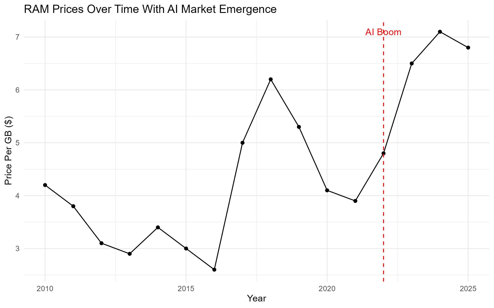
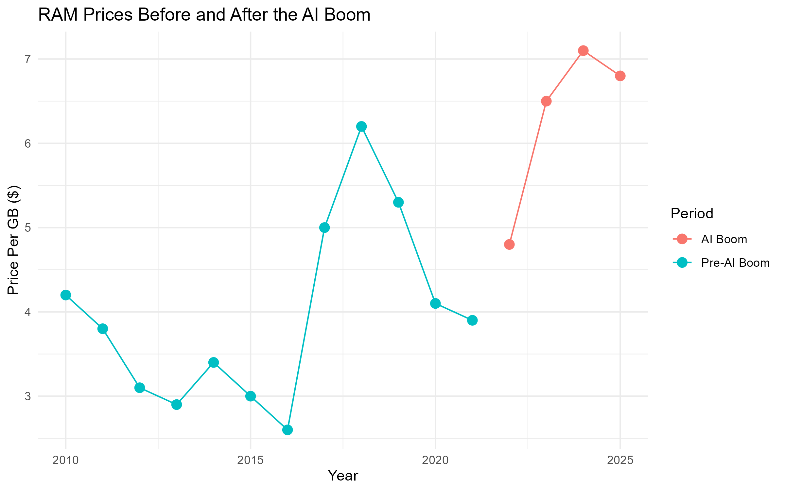
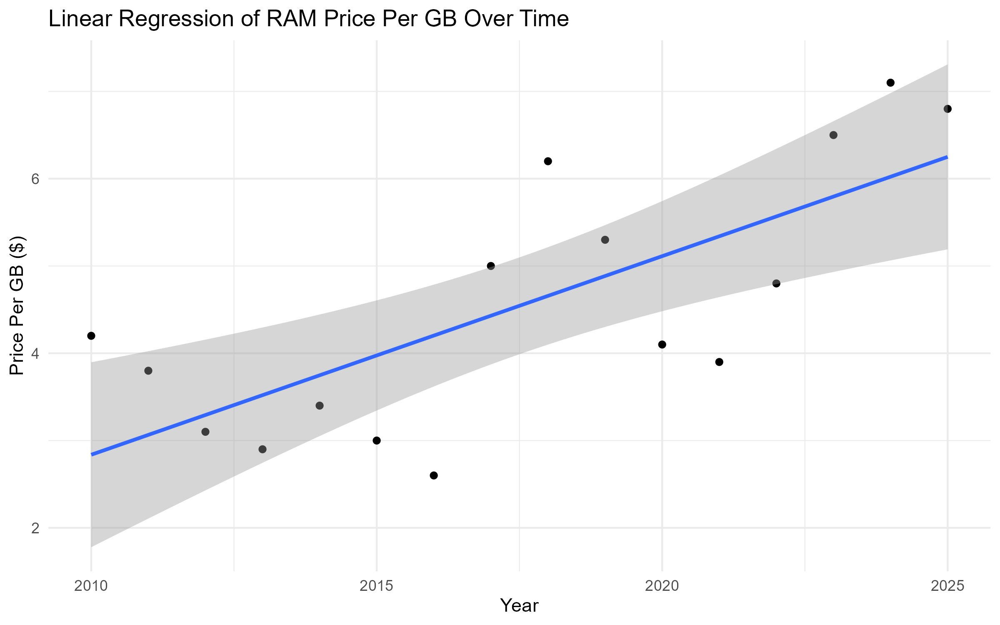
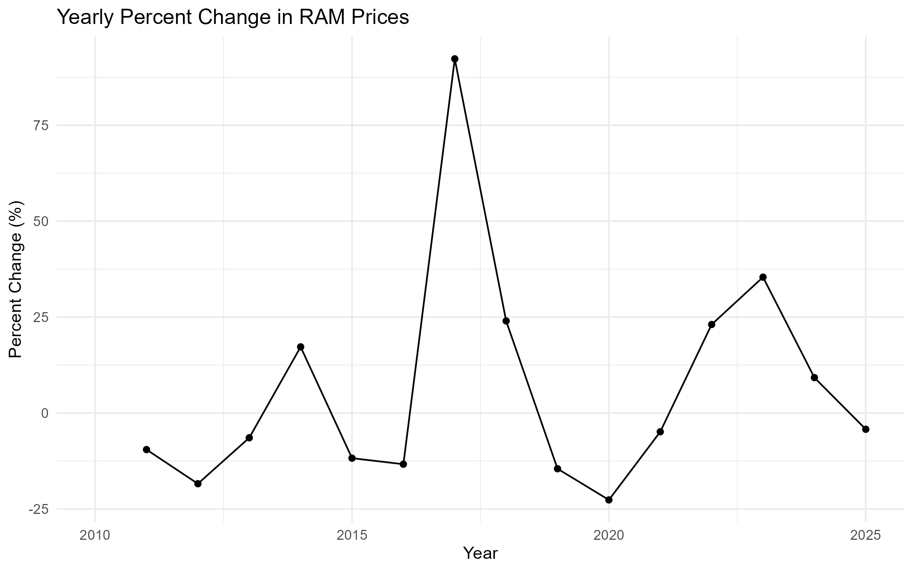

# Impact of AI on RAM Prices

The project analyzes how the emergence of artificial intelligence (AI) and large language models (LLMs) have influenced RAM market prices since modern AI systems require significant memory resources for training and inference, increased demand may affect hardware costs.


## Question

Did the emergence of AI and LLM technologies significantly impact RAM prices?

## Dataset

The dataset contains:

• Year  
• Price per GB of RAM  

The data represents historical RAM market pricing trends used to evaluate long-term changes.

## Technologies Used

• R  
• tidyverse  
• ggplot2  
• Statistical modeling  
• GitHub  

## Methods Used

The analysis includes:

• Data cleaning and preparation  
• Time series visualization  
• Linear regression modeling  
• Welch two sample t-test  
• Percent change analysis  
• Price volatility analysis  

## Visualizations

### RAM Price Trend Over Time



This visualization shows overall RAM price trends and highlights the emergence of AI around 2022.

---

### AI Era Price Comparison



This graph compares RAM prices before and after the AI boom period.

---

### Regression Analysis



Regression modeling shows a statistically significant relationship between time and RAM pricing.

---

### Price Volatility Analysis



This chart shows yearly percentage price changes and market volatility.

## Key Findings

Regression analysis showed:

• RAM prices increased over time  
• R² = 0.54  
• p-value = 0.00118  

T-test results showed:

• AI era average price: **$6.30**  
• Pre-AI average price: **$3.96**  
• p-value = **0.0099**

These results suggest RAM prices were significantly higher during the AI era.

## Conclusion

The analysis suggests a statistically significant relationship between the emergence of AI technologies and increased RAM prices. While causation cannot be definitively established, results support the hypothesis that increased AI demand may influence hardware pricing.


## Project Structure

```text

impact-of-ai-on-ram-prices/

analysis.R
README.md

data/
ram_prices.csv
group_summary.csv

charts/
ram_price_trend.png
ai_era_comparison.png
regression_plot.png
price_volatility.png
```

## How to Run

Install dependencies:

```r
install.packages("tidyverse")

Run:

source("analysis.R")
